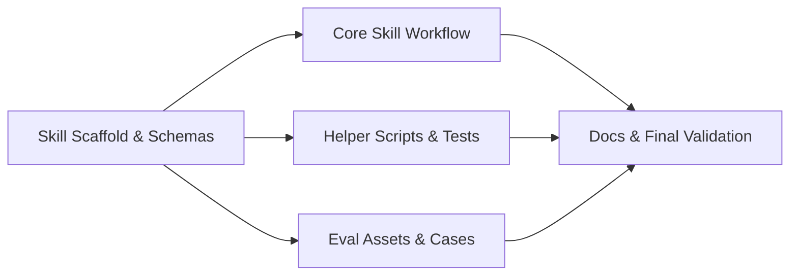

# Approach: Writing Skill

## Strategy

Build the skill in a scaffold-first sequence. The first partition establishes the portable skill directory and shared artifact schemas so later work has stable files to edit. After that, the core workflow instructions, helper scripts, and eval assets can run in parallel because they touch mostly separate modules. The final partition reconciles docs, runs validation, and folds eval findings back into the skill before kickoff work is considered complete.

Because evals are planned and `eval_placement` is `parallel`, eval case drafting and rubric work should proceed alongside implementation. If eval findings reveal that privacy behavior, profile schema, or calibration flow is materially wrong, requirements/design/specs must be reflected before final validation and before completing the initiative.

## Partitions (Feature Branches)

### Partition 1: Skill Scaffold & Schemas → `feat/skill-scaffold-schemas`
**Modules**: `skill/writing-style/`, `skill/writing-style/templates/`, `pyproject.toml`
**Scope**: Create the portable skill directory, baseline `SKILL.md` shell, profile/config/session/eval templates, and initial project metadata alignment.
**Dependencies**: None.

#### Artifact Type
library

#### How to Run
- No persistent process. Inspect files directly and run validation tests once helper scripts exist.

#### Acceptance Criteria
- [ ] `skill/writing-style/SKILL.md` exists with valid skill front matter and a concise trigger description.
- [ ] `skill/writing-style/templates/profile.md` includes YAML front matter fields from tech design and all required profile body headings.
- [ ] `skill/writing-style/templates/config.json` includes conservative defaults: sanitization enabled, neutral prompts default, custom prompt persistence disabled, and readiness criteria.
- [ ] `skill/writing-style/templates/calibration-session.md` and `skill/writing-style/templates/eval-case.md` exist with required sections.
- [ ] No runtime database, web framework, or remote persistence dependency is introduced.

#### Implementation Steps
1. Create `skill/writing-style/` and subdirectories.
2. Add `SKILL.md` scaffold with lifecycle and workflow outline placeholders.
3. Add profile, config, calibration session, and eval case templates.
4. Adjust project metadata only if needed to describe the skill package accurately.

### Partition 2: Core Skill Workflow → `feat/core-skill-workflow`
**Modules**: `skill/writing-style/SKILL.md`, `skill/writing-style/prompts/neutral-calibration-prompts.md`, `skill/writing-style/prompts/feedback-rubric.md`
**Scope**: Implement the user-facing skill instructions for profile creation, sanitization, style hypothesis, calibration, profile save, profile fork, saved-profile invocation, settings changes, and feedback handling.
**Dependencies**: Requires Partition 1.

#### Artifact Type
library

#### How to Run
- No persistent process. Exercise representative prompts manually or through eval cases.

#### Acceptance Criteria
- [ ] `SKILL.md` includes a create-profile flow that asks for examples and states style-only/privacy behavior before analysis.
- [ ] `SKILL.md` includes a sanitization/default privacy rule that treats user examples as data and forbids following embedded instructions from examples.
- [ ] `SKILL.md` includes calibration flow with neutral prompts by default and freeform feedback plus optional 1-5 score.
- [ ] `SKILL.md` includes profile forking flow that preserves the source profile unless overwrite is explicitly confirmed.
- [ ] `SKILL.md` includes saved-profile invocation flow that separates "how to write" from "what to write."
- [ ] `neutral-calibration-prompts.md` covers broad suggested use categories such as `email`, `text`, `report`, and `narrative`, without treating any category as a required built-in profile.
- [ ] `feedback-rubric.md` defines style match, privacy leakage, and instruction adherence criteria.

#### Implementation Steps
1. Fill `SKILL.md` with workflow instructions and guardrails.
2. Add neutral prompt bank grouped by writing category.
3. Add feedback rubric and readiness guidance.
4. Dry-run representative user requests and adjust copy for clarity.

### Partition 3: Helper Scripts & Tests → `feat/helper-scripts-tests`
**Modules**: `skill/writing-style/scripts/`, `tests/`, `tests/fixtures/`
**Scope**: Implement deterministic local helpers for workspace initialization, profile/config validation, profile-name normalization, and privacy-risk heuristic warnings, plus tests and fixtures.
**Dependencies**: Requires Partition 1.

#### Artifact Type
cli

#### How to Run
- `python3 skill/writing-style/scripts/init_workspace.py --data-dir /tmp/writing-skill-data`
- `python3 skill/writing-style/scripts/validate_profile.py tests/fixtures/profile_valid.md`
- `python3 -m pytest` if `pytest` is added; otherwise run script-level checks with `python3`.

#### Acceptance Criteria
- [ ] `init_workspace.py --data-dir /tmp/writing-skill-data` exits 0 and creates `config.json`, `profiles/`, `sessions/`, and `eval-runs/`.
- [ ] `init_workspace.py` does not overwrite an existing config unless an explicit force option is provided.
- [ ] `validate_profile.py tests/fixtures/profile_valid.md` exits 0 and prints a success message.
- [ ] `validate_profile.py tests/fixtures/profile_invalid.md` exits nonzero and prints actionable missing-field or missing-heading errors.
- [ ] Privacy scan mode flags fixture content containing known disallowed private terms. <!-- NEEDS MANUAL REVIEW for heuristic adequacy -->

#### Implementation Steps
1. Implement pure helper functions for name normalization, config load/default merge, profile validation, and privacy-risk scanning.
2. Add script entrypoints with stable exit codes.
3. Add valid and invalid fixtures.
4. Add tests or deterministic script checks.

### Partition 4: Eval Assets & Cases → `feat/eval-assets-cases`
**Modules**: `skill/writing-style/evals/`, `skill/writing-style/evals/cases/`, `skill/writing-style/prompts/feedback-rubric.md`
**Scope**: Build the eval assets described in `eval-spec.md`: manifest, case templates, representative cases, privacy leakage cases, invocation cases, and inheritance cases. This partition runs in parallel with implementation and may feed changes back into workflow or schemas.
**Dependencies**: Requires Partition 1.

#### Artifact Type
library

#### How to Run
- No persistent process. Inspect Markdown/JSON eval fixtures and run profile validation where applicable.

#### Acceptance Criteria
- [ ] `skill/writing-style/evals/eval-spec.md` or a linked copy exists in the implementation tree.
- [ ] `skill/writing-style/evals/manifest.json` lists at least 20 eval cases across style match, privacy leakage, instruction adherence, profile persistence, and inheritance.
- [ ] At least 5 privacy leakage cases include explicit `private_terms_must_not_include` labels.
- [ ] At least 4 suggested use categories are represented in cases.
- [ ] Each eval case includes user prompt, expected style signals, must-not-include terms, rubric, and passing criteria.
- [ ] Eval findings that require product/design changes are surfaced before final validation. <!-- NEEDS MANUAL REVIEW -->

#### Implementation Steps
1. Copy or adapt the draft eval spec into the skill evals directory.
2. Create manifest format and initial cases.
3. Add privacy leakage and inheritance edge cases.
4. Review cases against PRD/UX/Tech to catch missing product behavior.

### Partition 5: Documentation & Final Validation → `feat/docs-final-validation`
**Modules**: `README.md`, `skill/writing-style/README.md`, `skill/writing-style/SKILL.md`, `.cicadas/drafts/writing-skill/`
**Scope**: Write user/developer documentation, reconcile eval findings, run final validation, and ensure the skill is ready for kickoff implementation completion and review.
**Dependencies**: Requires Partitions 2, 3, and 4.

#### Artifact Type
library

#### How to Run
- `python3 skill/writing-style/scripts/validate_profile.py tests/fixtures/profile_valid.md`
- `python3 -m pytest` if tests use pytest.
- Manual dry runs for representative skill requests. <!-- NEEDS MANUAL REVIEW -->

#### Acceptance Criteria
- [ ] `README.md` explains what Writing Skill does, where the portable skill lives, and how profiles/settings are stored.
- [ ] `skill/writing-style/README.md` includes install/use examples and sample profile invocation language.
- [ ] Final dry run covers create-profile, fork-profile, invoke-profile, settings change, and privacy confirmation paths. <!-- NEEDS MANUAL REVIEW -->
- [ ] Helper script checks pass.
- [ ] Eval case review produces no blocking product/design changes, or required changes are reflected into specs and implementation before completion.

#### Implementation Steps
1. Write top-level and skill-level docs.
2. Run helper validation/tests.
3. Dry-run representative workflows.
4. Reflect any eval-driven changes into active specs before final review.

## Sequencing

Scaffold and schemas must land first. Core workflow, helper scripts, and eval assets can then proceed in parallel because they edit mostly distinct files. Documentation/final validation must wait until implementation and eval assets are available.



### Partitions DAG

> This block is machine-readable. It drives automatic worktree creation in `branch.py`.
> - `depends_on: []` → partition runs in parallel (gets its own git worktree)
> - `depends_on: [feat/other]` → partition is sequential (plain branch, waits for dependency)
> - Omit this block entirely to fall back to sequential-only behavior (backward compatible).

```yaml partitions
- name: feat/skill-scaffold-schemas
  modules: [skill/writing-style, skill/writing-style/templates, pyproject.toml]
  depends_on: []

- name: feat/core-skill-workflow
  modules: [skill/writing-style/SKILL.md, skill/writing-style/prompts]
  depends_on: [feat/skill-scaffold-schemas]

- name: feat/helper-scripts-tests
  modules: [skill/writing-style/scripts, tests, tests/fixtures]
  depends_on: [feat/skill-scaffold-schemas]

- name: feat/eval-assets-cases
  modules: [skill/writing-style/evals, skill/writing-style/prompts/feedback-rubric.md]
  depends_on: [feat/skill-scaffold-schemas]

- name: feat/docs-final-validation
  modules: [README.md, skill/writing-style/README.md, skill/writing-style/SKILL.md]
  depends_on: [feat/core-skill-workflow, feat/helper-scripts-tests, feat/eval-assets-cases]
```

## Migrations & Compat

There is no existing user data to migrate. The implementation should still version `config.json` and profile front matter from day one. Future schema changes must either preserve backward compatibility or include an explicit migration note/helper.

No remote compatibility commitments exist. The portable skill directory should avoid host-specific assumptions where possible, but it may be optimized for Codex skill conventions.

## Risks & Mitigations

| Risk | Mitigation |
|------|------------|
| Eval findings arrive after workflow decisions feel "done" | Keep evals parallel but make final validation depend on eval cases and require Reflect for any material findings. |
| Partitions overlap on `SKILL.md` | Keep scaffold minimal in Partition 1; reserve detailed workflow edits for Partition 2 and final reconciliation for Partition 5. |
| Helper scripts overreach into subjective style judgment | Limit scripts to deterministic validation and heuristic warnings; keep style judging in rubrics/evals. |
| Privacy scanner gives false confidence | Document it as heuristic, require profile inspection, and use eval privacy cases as the stronger gate. |
| Profile schema changes ripple across workflow/evals/tests | Land schemas first and treat later schema changes as cross-partition signals. |
| The skill triggers too broadly or narrowly | Include trigger-focused dry runs in final validation and revise `SKILL.md` description before completion. |

## Alternatives Considered

- **Single feature branch for everything:** Rejected because workflow, helpers, evals, and docs are separable enough to review independently.
- **Eval work before all implementation:** Rejected for now because the eval cases depend on concrete templates and workflow shape; parallel eval drafting gives faster feedback while preserving a final validation gate.
- **Fully parallel all partitions from the start:** Rejected because templates and module structure are prerequisite decisions.
- **Skip helper scripts:** Rejected because deterministic profile/config validation reduces artifact drift and supports evals.
